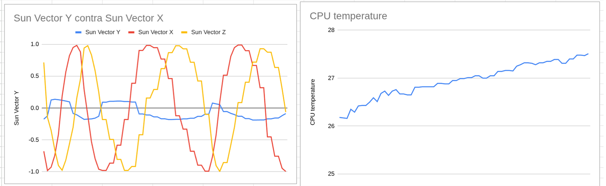

# Space Telemetry Decoder in C

Final practical assignment for the course **“M4 - Lenguajes y Sistemas Operativos de Aplicación Espacial”**  
Master’s Program in Space Application Development — **UNLAM (Universidad Nacional de La Matanza)**

---

## Overview

This project reads and decodes binary telemetry data (`*.bin`) from an **Argentine microsatellite beacon**.  
The telemetry packets are not received in order, and the **endianness (big-endian or little-endian)** is unknown, so the program must correctly interpret the data structure and convert it to engineering values.

The goal is to extract and export the **solar sensor readings (X, Y, Z)** and control values such as **CPU temperature** to a human-readable text file for external analysis and plotting.

---

## Features

- Reads a binary file containing unordered satellite telemetry packets.  
- Determines and handles **endianness** dynamically if necessary.  
- Extracts the **engineering values** for:
  - Solar sensors X, Y, Z
  - CPU temperature (for decoding validation)
- Writes results to a **CSV (comma-separated)** text file for plotting in LibreOffice Calc, Excel, etc.

## Results

The following results were obtained after graphing the results

